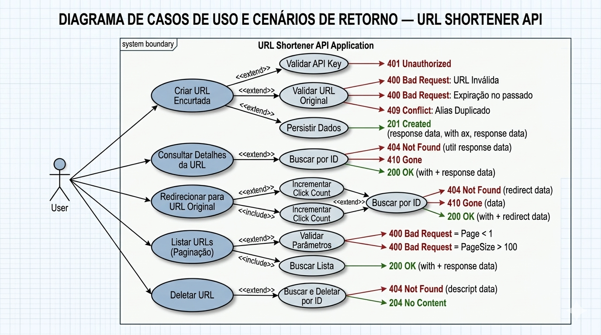
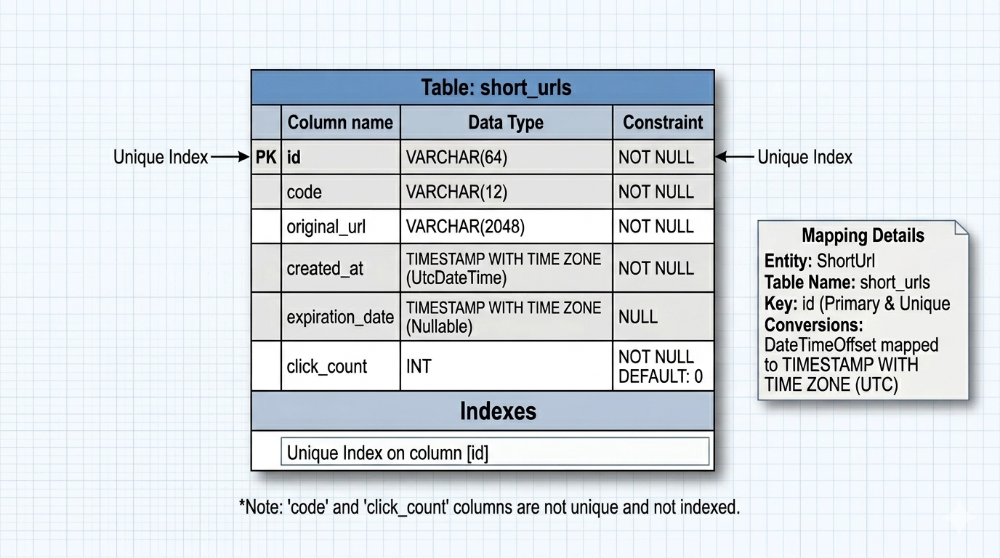

# URL Shortener API (.NET 8 + SQLite)

API de encurtamento de URLs, com redirecionamento para uma URL específica e busca de URLs.

---
## 📌 Sumário

1. [Objetivo](#objetivo)
2. [Diagramas de Arquitetura](#diagrama-de-use-case)
    - [Casos de Uso](#diagrama-de-use-case)
    - [Modelagem do Banco de Dados](#modelagem-do-banco)
3. [Stack Tecnológica](#linguagem--stack-utilizada)
4. [Como Rodar o Projeto](#como-rodar-o-projeto-passo-a-passo)
    - [Pré-requisitos](#pré-requisitos)
    - [Execução Local (.NET)](#executar-a-api-porta-8080)
    - [Execução via Docker Compose](#executar-com-docker-compose)
    - [Execução via Docker (Manual)](#executar-com-docker)
5. [Testes Unitários e Integrados](#como-rodar-os-testes)
6. [Decisões de Arquitetura](#decisões-de-arquitetura-breve)
    - [Estrutura do Projeto](#estrutura-simples-e-direta)
    - [Regras de Geração (ID, Alias e Expiração)](#como-o-id-é-gerado)
    - [Persistência e Segurança](#persistência-de-dados)
7. [Documentação da API (Endpoints)](#endpoints)
    - [POST - Criar URL](#criar-short-url)
    - [GET - Redirecionar](#redirecionar-url-específica)
    - [GET - Detalhes](#consultar-detalhes-de-um-id-específico)
    - [GET - Listagem Paginada](#listar-todas-urls-paginádas)
    - [DELETE - Remover URL](#delete-de-uma-url-específica)
8. [Configurações de Ambiente](#configuração)
9. [Checklist de Requisitos e Diferenciais](#regras-propostas-e-atingidas) 

# Objetivo
Construir uma API que retorne uma URL encurtada, estilo bitly. Podemos criar uma URL através do método POST, redirecionar URL através da GET /{id}, consultar uma URL específica pela rota GET /v1/urls/{id}, consultar todas as URLs cadastradas na /v1/urls e deletar uma URL com o DELETE /v1/urls/{id}.

## Diagrama de Use Case

## Modelagem do banco


## Linguagem / stack utilizada

- **.NET 8** (C#)
- **ASP.NET Core Web API (Controllers)**
- **Swagger / OpenAPI** (Swashbuckle)
- **EF Core + SQLite** (persistência em arquivo `app.db`)
- **xUnit** (testes)
- **FluentAssertions** (asserções nos testes) *(se incluído no projeto de testes)*

---

## Como rodar o projeto (passo a passo)

### Pré-requisitos
- **.NET SDK 8.x**
  - Verificar:
    ```bash
    dotnet --version
    ```

### Executar a API (porta 8080)
1. Na raiz do repositório, restaure as dependências:
   ```bash
   dotnet restore
   ```

2. Rode a API:
   ```bash
   dotnet run --project EncurtadorUrl.Api --urls http://localhost:8080
   ```

3. Acesse o Swagger:
   - http://localhost:8080/swagger


### Executar com Docker Compose
```bash
docker compose up --build
```

### Executar com Docker
1. Construa a imagem:
   ```bash
   docker build -t desafio-encurtador-de-url .
   ```

2. Crie o volume para persistência de dados:
   ```bash
   docker volume create urlshortener-data
   ```

3. Execute o container:
   ```bash
   docker run --rm -p 8080:8080 -v urlshortener-data:/app/data -e ConnectionStrings__Sqlite="Data Source=/app/data/app.db" desafio-encurtador-de-url
   ```

4. Acesse o Swagger:
   - http://localhost:8080/swagger

### Observações
- O banco SQLite é um arquivo chamado **`app.db`** e é criado automaticamente na primeira execução.
- A API Key para o endpoint de criação vem de `appsettings.json`:
  - `Shortener:ApiKey`
      - API-KEY tem o valor de: itau

---

## Como rodar os testes

Na raiz do repositório:

```bash
dotnet test
```

---

## Decisões de arquitetura (breve)

### Estrutura (simples e direta)
- **Controllers/**: camada HTTP (endpoints)
- **Resources/**: DTOs (request/response)
- **Services/**: regras de negócio (validações, geração de código, expiração, incremento de clique)
- **Repositories/**: acesso a dados via EF Core (queries e persistência)
- **Domain/**: entidade de domínio (`ShortUrl`)
- **Data/**: `AppDbContext` (mapeamento EF Core)
- **Middleware/**: tratamento global de erros e API Key

### Como o ID é gerado
- O banco gera um `Id` é uma string gerada automáticamente e tem o valor mínimo de 5 caracteres seu padrão é um alfanumérico de base62.
- Benefícios:
  - **Sem colisão**
  - Simples de explicar e manter
  - URL-friendly (apenas caracteres alfanuméricos)

### Como o customAlias/code é gerado
- Quando **não** é informado `customAlias`, o código é gerado pela aplicação, levando em consideração o padrão `aaaa-aaaa`.
- Se o cliente passar um `customAlias`,ele pode ser gerado no mesmo padrão. Lembrando que `permite apenas letras, números, '-' e '_'`.

### Como o expirationDate é gerado
- Quando **não** é informado `expirationDate`, é gerado pela aplicação tem o padrão 5 minutos.
- Se o cliente passar um `expirationDate`,ele tem que ser futuro.

### Como o shortUrl é gerado
- Recebe o mesmo valor do `ID`. Não pode ser alterado.

### Como o clickCount é gerado
- clickCount é incrementado apenas pela rota GET /{id}. A rota GET /v1/urls/{id} e GET /v1/urls não acrescenta a contegem de cliques.

### Persistência de dados
- Persistência com **SQLite** (arquivo `app.db`) usando **EF Core**.
- A tabela principal é `short_urls` 
- Datas: Armazenadas em formato UTC através de conversores de valor (DateTimeOffset para DateTime UTC).
- **PK e Índice único em `ID`** garante unicidade (ID gerados).

### Segurança (API Key)
- O endpoint `POST /v1/urls` exige o header:
  - `X-API-Key: <valor>`
- O valor é configurado em `appsettings.json`:
  - `Shortener:ApiKey`

### Erros padronizados
- Erros são retornados no formato **ProblemDetails** (`application/problem+json`), incluindo `traceId`.
- Status codes usados:
  - `400` validação
  - `401` API key inválida/ausente
  - `404` id inexistente
  - `409` alias duplicado
  - `410` expirada

---

## Endpoints

### Criar short URL
- **POST** `/v1/urls`
- **Headers**
  - `Content-Type: application/json`
  - `X-API-Key: itau`

### Request 

Por padrão o único campo obrigatório na rota POST é `originalUrl`.
O `customAlias` se não informado é gerado na aplicação e  `expirationDate` se não informado, tem a duração por padrão de 5 minutos.

```
{
  "originalUrl": "https://github.com"
} 
```
#### Exemplo (curl)
```bash
curl -i -X POST "http://localhost:8080/v1/urls" \
  -H "Content-Type: application/json" \
  -H "X-API-Key: itau" \
  -d '{
    "originalUrl": "https://www.google.com",
    "customAlias": "google_01",
    "expirationDate": "2026-12-31T23:59:59Z"
  }'
```

#### Exemplo de resposta (201)
```json
{
  "id": "L7iNE",
  "customAlias": "google_01",
  "shortUrl": "http://localhost:8080/L7iNE",
  "originalUrl": "https://www.google.com",
  "createdAt": "2026-03-10T04:18:10.7602021+00:00",
  "expirationDate": "2026-12-31T23:59:59+00:00",
  "clickCount": 0
}
```

---

### Redirecionar URL específica
- **GET** `/{id}`
- Retorna **200** com response Body contendo a URL.

#### Exemplo (curl)
```bash
curl -i "http://localhost:8080/L7iNE"
```

#### Exemplo de resposta (200)
```
https://www.google.com
```

---

### Consultar detalhes de um ID específico
- **GET** `/v1/urls/{id}`

#### Exemplo (curl)
```bash
curl -i "http://localhost:8080/v1/urls/L7iNE"
```

#### Exemplo de resposta (200)
```json
{
  "id": "L7iNE",
  "customAlias": "google_01",
  "shortUrl": "http://localhost:8080/L7iNE",
  "originalUrl": "https://www.google.com",
  "createdAt": "2026-03-10T04:18:10.7602021+00:00",
  "expirationDate": "2026-12-31T23:59:59+00:00",
  "clickCount": 1
}
```


---

### Listar todas URLs paginádas
- **GET** `/v1/urls`

Definido páginação máxima para 100 registros.

#### Exemplo (curl)
```bash
curl -i "http://localhost:8080/v1/urls"
```

#### Exemplo de resposta (200)
```json
[
  {
    "id": "D8X1F",
    "customAlias": "itau-home",
    "shortUrl": "http://localhost:8080/D8X1F",
    "originalUrl": "https://itau.com",
    "createdAt": "2026-03-10T16:41:40.9333372+00:00",
    "expirationDate": "2026-03-11T16:35:45.218+00:00",
    "clickCount": 0
  },
  {
    "id": "e8NT8",
    "customAlias": "teste",
    "shortUrl": "http://localhost:8080/e8NT8",
    "originalUrl": "https://github.com",
    "createdAt": "2026-03-10T16:41:01.8794511+00:00",
    "expirationDate": "2026-03-11T16:35:45.218+00:00",
    "clickCount": 0
  }
]
```

### Delete de uma URL específica
- **DELETE** `/v1/urls/{id}`

#### Exemplo (curl)
```bash
curl -X 'DELETE' \
  'http://localhost:8080/v1/urls/e8NT8' \
  -H 'accept: */*'
```

#### resposta (204) No Content


## Configuração

- `UrlShortener.Api/appsettings.json`
  - `Shortener:BaseUrl` = `http://localhost:8080`
  - `Shortener:ApiKey` = `itau`
  - `ConnectionStrings:Sqlite` = `Data Source=app.db`
  
## Regras propostas e atingidas 
- [x] Geração de IDs curto legível em URLs (ex.: base62, alfanumérico).
- [x] Evitar colisões (duas URLs diferentes não podem ter o mesmo id).
- [x] Comportamento de redirecionamento e erros.
- [x] Não aceitar originalUrl vazia ou nula.
- [x] Validar se é uma URL bem formada. 
- [x] Redirecionar corretamente para a originalUrl.
- [x] Tratar casos de id inexistente.
- [x] Se implementar expiração: não redirecionar URLs expiradas

## Regras adicionais incluidas:
- [x] Contabilizar clickCount (quantas vezes a URL encurtada foi acessada). Lembrando que é - [x] incrementado apenas pela rota GET /{id}. A rota GET /v1/urls/{id} e GET /v1/urls não - [x] acrescenta a contegem de cliques.
- [x] cliente envie um alias customizado. Lembrando que ele possui um padrão próprio definido. Assim, não haverá conflitos de IDs. 
- [x] foi incluido o campo expirationDate. Caso não informado, Define o valor de 5 minutos por padrão. Ele segue validações e deve ser informado sempre no futuro.
- [x] o header X-API-Key obrigatório é apenas para rota POST que cria as URLs.
- [x] Adicionado dois endpoints um para Consultar todas as URLs cadastradas na /v1/urls e outro para deletar uma URL com o DELETE /v1/urls/{id}.
- [x] foi adicionado Dockerfile e/ou docker-compose para facilitar a execução 
- [x] teste integrado validando end to end tanto da rota que cria URL como a que consulta.
