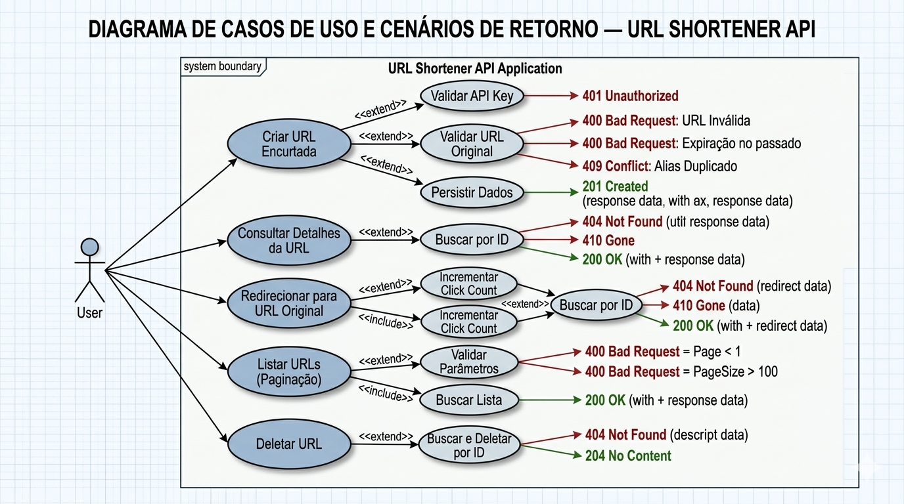
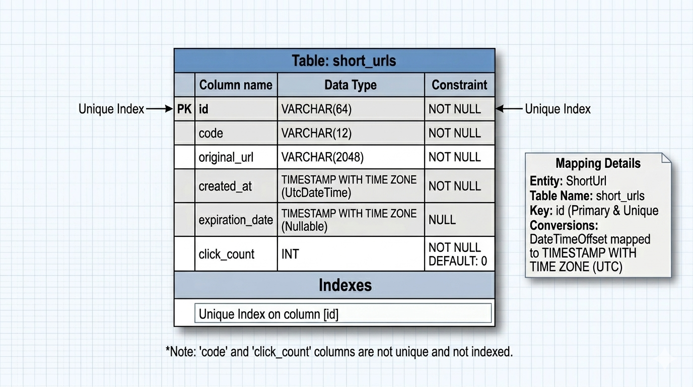
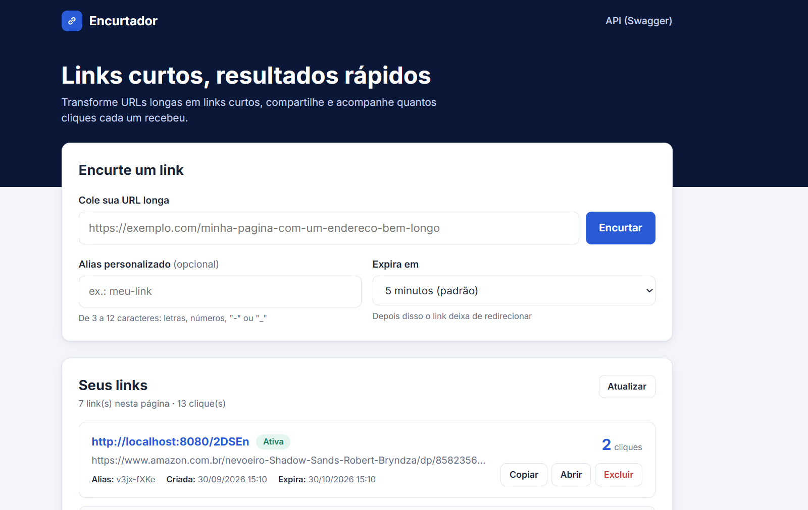

# URL Shortener (.NET 8 + MySQL + Angular)

Encurtador de URLs estilo bitly: API .NET 8 com MySQL e frontend em Angular para criar, listar, abrir e excluir links curtos.

## 🚀 Início rápido

> **A forma mais fácil de rodar:** só precisa do [Docker Desktop](https://www.docker.com/products/docker-desktop/). Não precisa instalar .NET, Node.js nem MySQL, nem criar `.env`.

```bash
git clone https://github.com/wesleysrocha/desafio-encurtador-de-url.git
cd desafio-encurtador-de-url
docker compose up -d --build
```

Pronto! Sobem 3 containers (MySQL, API e frontend):

| O quê | Endereço |
|---|---|
| 🖥️ Frontend (Angular) | **http://localhost:4200** |
| 📘 API (Swagger) | http://localhost:8080/swagger |
| 🗄️ MySQL | `localhost:3306` |

- API Key para criar URLs (`POST /v1/urls`): `X-API-Key: itau`
- MySQL em `localhost:3306` (usuário `root`, senha `root`, banco `url_shortener`)
- Para parar: `docker compose down` (os dados continuam salvos)

Outras formas de rodar: veja [Como rodar o projeto](#como-rodar-o-projeto-passo-a-passo) e [Frontend (Angular)](#frontend-angular).

---
## 📌 Sumário

0. [🚀 Início rápido](#-início-rápido)
1. [Objetivo](#objetivo)
2. [Diagramas de Arquitetura](#diagrama-de-use-case)
    - [Casos de Uso](#diagrama-de-use-case)
    - [Modelagem do Banco de Dados](#modelagem-do-banco)
3. [Stack Tecnológica](#linguagem--stack-utilizada)
4. [Como Rodar o Projeto (3 formas)](#como-rodar-o-projeto-passo-a-passo)
    - [Pré-requisitos](#pré-requisitos)
    - [Forma 1: Docker Compose ⭐ recomendado](#forma-1-docker-compose-recomendado)
    - [Forma 2: API local com .NET e MySQL no Docker](#forma-2-api-local-com-net-e-mysql-no-docker)
    - [Forma 3: Docker manual (sem Compose)](#forma-3-docker-manual-sem-compose)
    - [Configurar o `.env` (opcional)](#configurar-o-env-opcional)
    - [Acessar o banco MySQL](#acessar-o-banco-mysql)
    - [Problemas comuns](#problemas-comuns)
5. [Frontend (Angular)](#frontend-angular)
    - [O que instalar](#o-que-instalar)
    - [Rodar com Docker](#rodar-o-frontend-com-docker)
    - [Rodar com `npm start`](#rodar-o-frontend-com-npm-start)
    - [Estrutura do frontend](#estrutura-do-frontend)
6. [Testes Unitários e Integrados](#como-rodar-os-testes)
7. [Decisões de Arquitetura](#decisões-de-arquitetura-breve)
    - [Estrutura do Projeto](#estrutura-simples-e-direta)
    - [Regras de Geração (ID, Alias e Expiração)](#como-o-id-é-gerado)
    - [Persistência e Segurança](#persistência-de-dados)
8. [Documentação da API (Endpoints)](#endpoints)
    - [POST - Criar URL](#criar-short-url)
    - [GET - Redirecionar](#redirecionar-url-específica)
    - [GET - Detalhes](#consultar-detalhes-de-um-id-específico)
    - [GET - Listagem Paginada](#listar-todas-urls-paginádas)
    - [DELETE - Remover URL](#delete-de-uma-url-específica)
9. [Configurações de Ambiente](#configuração)
10. [Checklist de Requisitos e Diferenciais](#regras-propostas-e-atingidas) 

# Objetivo
Construir uma API que retorne uma URL encurtada, estilo bitly. Podemos criar uma URL através do método POST, redirecionar URL através da GET /{id}, consultar uma URL específica pela rota GET /v1/urls/{id}, consultar todas as URLs cadastradas na /v1/urls e deletar uma URL com o DELETE /v1/urls/{id}.

## Diagrama de Use Case

## Modelagem do banco


## Linguagem / stack utilizada

- **.NET 8** (C#)
- **ASP.NET Core Web API (Controllers)**
- **Swagger / OpenAPI** (Swashbuckle)
- **EF Core 8 + MySQL 8.0** (via Pomelo.EntityFrameworkCore.MySql)
- **DotNetEnv** (carrega variáveis de um arquivo `.env`)
- **xUnit** (testes)
- **FluentAssertions** e **Moq** (asserções e mocks nos testes)
- **SQLite em memória** (apenas nos testes, sem arquivo em disco)
- **Angular 20** (frontend, componentes standalone + signals)
- **Nginx** (serve o frontend e faz proxy de `/api` para a API)
- **Docker / Docker Compose** (MySQL 8.0 + API + frontend)

---

## Como rodar o projeto (passo a passo)

O banco de dados da aplicação é o **MySQL 8**. Há três formas de rodar o projeto:

| # | Forma | Como o MySQL roda | Como a API roda | Precisa de | Comando principal | Quando usar |
|---|---|---|---|---|---|---|
| **1** ⭐ | [Docker Compose](#forma-1-docker-compose-recomendado) **(recomendado)** | Container `mysql:8.0` subido pelo compose | Container | Docker | `docker compose up -d --build` | Mais fácil: sobe banco + API + frontend com um comando |
| 2 | [API local com .NET](#forma-2-api-local-com-net-e-mysql-no-docker) | Container do compose (`docker compose up -d mysql`) ou MySQL instalado na máquina | `dotnet run` | Docker + .NET 8 | `dotnet run --project EncurtadorUrl.Api` | Desenvolver e debugar no Visual Studio / VS Code |
| 3 | [Docker manual](#forma-3-docker-manual-sem-compose) | Container `mysql:8.0` criado com `docker run` | Container (`docker run`) | Docker | `docker build` + `docker run` | Entender/controlar cada passo sem o Compose |

Na Forma 1 o frontend já sobe junto em http://localhost:4200. Nas Formas 2 e 3, veja como subir o frontend em [Frontend (Angular)](#frontend-angular).

Em todas as formas o banco `url_shortener` e a tabela `short_urls` são criados automaticamente na primeira execução.

### Pré-requisitos
- **Docker Desktop** (inclui o Docker Compose v2)
  ```bash
  docker --version
  docker compose version
  ```
- **Node.js 20.19+ ou 22.12+** (apenas para rodar o frontend com `npm start`)
  ```bash
  node -v
  ```
- **.NET SDK 8.x** (apenas para rodar a API localmente ou os testes)
  ```bash
  dotnet --version
  ```
- **MySQL 8.x**: não precisa instalar, o `docker-compose.yml` já sobe um container `mysql:8.0`.

### Forma 1: Docker Compose (recomendado)
Sobe o MySQL, a API e o frontend juntos, sem precisar de `.env`, .NET ou Node.js instalados. A API só inicia depois que o MySQL passa no healthcheck, e as tabelas são criadas automaticamente na primeira execução.

1. Na raiz do repositório, suba o MySQL, a API e o frontend:

   ```bash
   docker compose up -d --build
   ```

2. Verifique se os containers estão rodando (o MySQL deve aparecer como `healthy`):

   ```bash
   docker compose ps
   ```

3. Acesse:
   * Frontend: http://localhost:4200
   * Swagger: http://localhost:8080/swagger

4. Para parar (os dados continuam salvos no volume):

   ```bash
   docker compose down
   ```

Comandos úteis:

| Comando | O que faz |
|---|---|
| `docker compose logs -f urlshortener-api` | Acompanha os logs da API |
| `docker compose logs -f mysql` | Acompanha os logs do MySQL |
| `docker compose logs -f urlshortener-web` | Acompanha os logs do frontend (Nginx) |
| `docker compose up -d --build urlshortener-web` | Recompila e reinicia só o frontend |
| `docker compose up -d --build urlshortener-api` | Recompila e reinicia só a API após alterar o código |
| `docker compose stop` | Para os containers sem removê-los |
| `docker compose down -v` | Remove os containers **e apaga os dados** do MySQL |

> ⚠️ **Trocou a senha no `.env`?** O MySQL só aplica a senha na **primeira** criação do volume. Se o volume já existir com outra senha, a API falha com `Access denied for user 'root'`. Recrie o volume (os dados serão apagados) com `docker compose down -v` e depois `docker compose up -d --build`.

### Forma 2: API local com .NET e MySQL no Docker
Roda a API com `dotnet run` (bom para debugar no Visual Studio / VS Code) e usa o MySQL em container.

1. (Opcional) Crie o `.env` (veja [Configurar o `.env`](#configurar-o-env-opcional)). Sem ele, a API conecta em `localhost:3306` com `root`/`root`.

2. Suba apenas o MySQL:

   ```bash
   docker compose up -d mysql
   ```

3. Aguarde o MySQL ficar `healthy`:

   ```bash
   docker compose ps
   ```

4. Na raiz do repositório, restaure as dependências:

   ```bash
   dotnet restore
   ```

5. Rode a API:

   ```bash
   dotnet run --project EncurtadorUrl.Api --urls http://localhost:8080
   ```

6. Acesse o Swagger:
   * http://localhost:8080/swagger

7. Para parar: `Ctrl + C` no terminal da API e, para desligar o MySQL:

   ```bash
   docker compose down
   ```

> 💡 Se você já tem um MySQL 8 instalado na máquina, pule os passos 2 e 3 e ajuste as credenciais no `.env`.

### Forma 3: Docker manual (sem Compose)
Faz o mesmo que o Docker Compose, mas com comandos `docker` individuais: cria uma rede, um volume, o container do MySQL e o container da API.

1. Construa a imagem da API:

   ```bash
   docker build -t desafio-encurtador-de-url .
   ```

2. Crie a rede para a API e o MySQL se comunicarem:

   ```bash
   docker network create urlshortener-net
   ```

3. Crie o volume para persistência dos dados do MySQL:

   ```bash
   docker volume create urlshortener-mysql-data
   ```

4. Suba o container do MySQL:

   ```bash
   docker run -d --name urlshortener-mysql --network urlshortener-net -p 3306:3306 -v urlshortener-mysql-data:/var/lib/mysql -e MYSQL_ROOT_PASSWORD=root -e MYSQL_DATABASE=url_shortener mysql:8.0
   ```

5. Aguarde o MySQL ficar pronto (repita até aparecer `mysqld is alive`):

   ```bash
   docker exec urlshortener-mysql mysqladmin ping -uroot -proot
   ```

6. Execute o container da API:

   ```bash
   docker run --rm -d --name urlshortener-api --network urlshortener-net -p 8080:8080 -e DB_HOST=urlshortener-mysql -e DB_PASSWORD=root desafio-encurtador-de-url
   ```

7. Acesse o Swagger:
   * http://localhost:8080/swagger

8. (Opcional) Construa e rode o frontend na mesma rede:

   ```bash
   docker build -t encurtador-web ./EncurtadorUrl.Web
   docker run --rm -d --name urlshortener-web --network urlshortener-net -p 4200:80 encurtador-web
   ```
   Acesse http://localhost:4200

9. Para parar e remover tudo:

   ```bash
   docker stop urlshortener-web urlshortener-api urlshortener-mysql
   docker rm urlshortener-mysql
   docker network rm urlshortener-net
   ```
   Para apagar também os dados: `docker volume rm urlshortener-mysql-data`.

> ⚠️ Não rode a Forma 3 ao mesmo tempo que a Forma 1: os containers usam os mesmos nomes e portas (`3306`, `8080` e `4200`). Rode `docker compose down` antes.

### Configurar o `.env` (opcional)
As credenciais do banco ficam no arquivo `.env` na raiz do repositório. **Ele é opcional:** sem `.env`, o Docker Compose e a API usam os mesmos valores padrão (usuário `root`, senha `root`, banco `url_shortener`), então tudo funciona sem configurar nada.

Para personalizar, crie o `.env` a partir do exemplo:

```bash
# Git Bash / Linux / macOS
cp .env.example .env
```
```powershell
# PowerShell
Copy-Item .env.example .env
```

Conteúdo esperado:
```
DB_HOST=localhost
DB_PORT=3306
DB_USER=root
DB_PASSWORD=root
DB_NAME=url_shortener
```

| Variável | Descrição | Padrão |
|---|---|---|
| `DB_HOST` | Host do MySQL (no Docker Compose é sobrescrito para `mysql`) | `localhost` |
| `DB_PORT` | Porta do MySQL | `3306` |
| `DB_USER` | Usuário do MySQL | `root` |
| `DB_PASSWORD` | Senha do usuário (também vira a senha de `root` do container MySQL) | `root` |
| `DB_NAME` | Nome do banco (criado automaticamente) | `url_shortener` |

> 🔒 O `.env` está no `.gitignore` e **não deve ser commitado**. Coloque senhas reais apenas nele, nunca no `.env.example` nem no README.
>
> Se a senha tiver `$`, coloque o valor entre aspas simples (ex.: `DB_PASSWORD='minha$senha'`), senão o Docker Compose e o DotNetEnv tratam `$...` como variável.

### Acessar o banco MySQL
As tabelas são criadas automaticamente na primeira execução (`EnsureCreated`). A tabela principal é `short_urls`. Funciona com o MySQL de qualquer uma das 3 formas (o container se chama `urlshortener-mysql` em todas).

1. Abra o cliente MySQL dentro do container:

   ```bash
   docker exec -it urlshortener-mysql mysql -uroot -p url_shortener
   ```

2. Digite a senha quando for pedida (`root` por padrão, ou a do `.env`).

3. Consulte os dados:

   ```sql
   SHOW TABLES;
   SELECT * FROM short_urls;
   ```

4. Para sair: `exit`

> 💡 Também dá para usar um cliente gráfico (MySQL Workbench, DBeaver, extensão do VS Code) em `localhost:3306`, com usuário `root`, senha `root` (ou a do `.env`) e banco `url_shortener`.

### Problemas comuns

| Sintoma | Causa provável | Solução |
|---|---|---|
| `Access denied for user 'root'` | Volume do MySQL criado com outra senha, ou senha com `$` sem aspas simples no `.env` | Confira o `.env` e rode `docker compose down -v` |
| `Unable to connect to any of the specified MySQL hosts` | MySQL ainda subindo ou `DB_HOST` errado | Aguarde o `healthy` em `docker compose ps`; use `localhost` no `dotnet run` e `urlshortener-mysql` na Forma 3 |
| `port is already allocated` (3306, 8080 ou 4200) | Outro MySQL/serviço usando a porta | Pare o serviço local (ou a outra forma que estiver rodando) ou altere o mapeamento de portas |
| Link curto mostra a URL em texto em vez de abrir a página | Imagem da API desatualizada | Recompile: `docker compose up -d --build urlshortener-api` |
| Frontend mostra "Não foi possível conectar à API" | API parada ou fora da porta 8080 | Confira http://localhost:8080/swagger e `docker compose ps` |
| `npm install` falha ou `ng` não é reconhecido | Node.js ausente ou muito antigo | Instale o Node.js LTS (20.19+ ou 22.12+) e rode `npm install` dentro de `EncurtadorUrl.Web` |

### Observações
- A API Key do endpoint de criação (`POST /v1/urls`) é `itau`, configurada em `Shortener:ApiKey`.

---

## Frontend (Angular)

Interface web no estilo bitly para encurtar links, copiar, abrir, acompanhar cliques e excluir URLs. Fica na pasta `EncurtadorUrl.Web/` e conversa com a API .NET, que grava no MySQL.

## tela inicial (frontend)


O que a tela faz
- **Encurtar URL**: campo para a URL longa, alias personalizado (opcional, 3 a 12 caracteres) e tempo de expiração (5 min, 1 hora, 1 dia, 7 dias ou 30 dias).
- **Resultado**: mostra o link curto com botão **Copiar**.
- **Seus links**: lista paginada (10 por página) com status **Ativa/Expirada**, número de cliques, datas e os botões **Copiar**, **Abrir** e **Excluir**.
- O link curto e o botão **Abrir** abrem `http://localhost:8080/{id}` em uma nova aba: a API conta o clique e redireciona (302) para a URL original. Links expirados não redirecionam (410).

### Como o frontend se conecta ao backend
O navegador sempre chama o próprio frontend em `/api/...`, e esse prefixo é encaminhado para a API. Por isso não é preciso configurar CORS.

| Ambiente | Quem encaminha `/api` | Destino |
|---|---|---|
| `npm start` (desenvolvimento) | `EncurtadorUrl.Web/proxy.conf.json` | `http://localhost:8080` |
| Docker | `EncurtadorUrl.Web/nginx.conf` (Nginx) | `http://urlshortener-api:8080` |

```
Navegador ──▶ Frontend :4200 ──/api──▶ API .NET :8080 ──▶ MySQL :3306
```

### O que instalar
| Para rodar com... | Precisa de |
|---|---|
| Docker (recomendado) | Apenas o **Docker Desktop** |
| `npm start` | **Node.js 20.19+ ou 22.12+** (versão LTS em [nodejs.org](https://nodejs.org/)), que já inclui o **npm**. O Angular CLI é instalado junto com as dependências do projeto, não precisa instalar globalmente. |

Para conferir as versões:
```bash
node -v
npm -v
```

### Rodar o frontend com Docker
O frontend já faz parte do `docker-compose.yml` (serviço `urlshortener-web`).

1. Na raiz do repositório, suba tudo (MySQL + API + frontend):

   ```bash
   docker compose up -d --build
   ```

2. Acesse o frontend:
   * http://localhost:4200

3. Após alterar o código do frontend, recompile só ele:

   ```bash
   docker compose up -d --build urlshortener-web
   ```

### Rodar o frontend com `npm start`
Bom para desenvolver: a página recarrega sozinha a cada alteração no código.

1. Suba o MySQL e a API (por exemplo, com Docker):

   ```bash
   docker compose up -d mysql urlshortener-api
   ```

   Ou rode a API com `dotnet run` (veja a [Forma 2](#forma-2-api-local-com-net-e-mysql-no-docker)). A API precisa estar em `http://localhost:8080`.

2. Entre na pasta do frontend:

   ```bash
   cd EncurtadorUrl.Web
   ```

3. Instale as dependências (só na primeira vez ou quando o `package.json` mudar):

   ```bash
   npm install
   ```

4. Rode o servidor de desenvolvimento:

   ```bash
   npm start
   ```

5. Acesse o frontend:
   * http://localhost:4200

6. Para parar: `Ctrl + C` no terminal.

> ⚠️ Se o container `urlshortener-web` estiver rodando, ele já ocupa a porta 4200. Pare-o antes com `docker compose stop urlshortener-web`.

### Gerar o build de produção
```bash
cd EncurtadorUrl.Web
npm run build
```
Os arquivos estáticos são gerados em `EncurtadorUrl.Web/dist/encurtador-url-web/browser/`.

### Estrutura do frontend
```
EncurtadorUrl.Web/
├── src/
│   ├── index.html, main.ts, styles.css      # entrada da aplicação e estilos globais
│   └── app/
│       ├── app.ts / app.html / app.css      # layout (topo, hero, conteúdo)
│       ├── app.config.ts                    # providers (HttpClient)
│       ├── core/
│       │   ├── api.config.ts                # prefixo /api e API Key
│       │   ├── short-url.service.ts         # chamadas HTTP para a API
│       │   ├── error-message.ts             # converte ProblemDetails em mensagem
│       │   └── clipboard.ts                 # copiar para a área de transferência
│       ├── models/short-url.ts              # tipos ShortUrl e CreateShortUrlRequest
│       └── components/
│           ├── shorten-form/                # formulário "Encurte um link"
│           └── url-list/                    # lista "Seus links"
├── proxy.conf.json                          # proxy /api -> localhost:8080 (npm start)
├── nginx.conf                               # proxy /api -> urlshortener-api (Docker)
├── Dockerfile                               # build Node + Nginx
└── package.json / angular.json / tsconfig*.json
```

### Configuração do frontend
- `src/app/core/api.config.ts`
  - `API_BASE_URL` = `/api` (prefixo encaminhado para a API)
  - `API_KEY` = `itau` (enviado no header `X-API-Key` do `POST /v1/urls`; deve ser igual a `Shortener:ApiKey` da API)

> 🔒 A API Key fica no código que roda no navegador, então qualquer pessoa consegue vê-la. Para este desafio isso é aceitável; em produção, a criação de links deveria ser protegida por autenticação de usuário.

---

## Como rodar os testes

Na raiz do repositório:

```bash
dotnet test
```

Os testes cobrem a API .NET e **não precisam do MySQL nem do Docker**: os testes de repositório e os integrados usam SQLite em memória (`Data Source=:memory:`), recriado a cada execução, sem gerar arquivo no disco.

---

## Decisões de arquitetura (breve)

### Estrutura (simples e direta)
- **Controllers/**: camada HTTP (endpoints)
- **Resources/**: DTOs (request/response)
- **Services/**: regras de negócio (validações, geração de código, expiração, incremento de clique)
- **Repositories/**: acesso a dados via EF Core (queries e persistência)
- **Domain/**: entidade de domínio (`ShortUrl`)
- **Data/**: `AppDbContext` (mapeamento EF Core para MySQL)
- **Middleware/**: tratamento global de erros e API Key
- **EncurtadorUrl.Web/**: frontend Angular (veja [Estrutura do frontend](#estrutura-do-frontend))

### Como o ID é gerado
- O banco gera um `Id` é uma string gerada automáticamente e tem o valor mínimo de 5 caracteres seu padrão é um alfanumérico de base62.
- Benefícios:
  - **Sem colisão**
  - Simples de explicar e manter
  - URL-friendly (apenas caracteres alfanuméricos)

### Como o customAlias/code é gerado
- Quando **não** é informado `customAlias`, o código é gerado pela aplicação, levando em consideração o padrão `aaaa-aaaa`.
- Se o cliente passar um `customAlias`,ele pode ser gerado no mesmo padrão. Lembrando que `permite apenas letras, números, '-' e '_'`.

### Como o expirationDate é gerado
- Quando **não** é informado `expirationDate`, é gerado pela aplicação tem o padrão 5 minutos.
- Se o cliente passar um `expirationDate`,ele tem que ser futuro.

### Como o shortUrl é gerado
- Recebe o mesmo valor do `ID`. Não pode ser alterado.

### Como o clickCount é gerado
- clickCount é incrementado apenas pela rota GET /{id}. A rota GET /v1/urls/{id} e GET /v1/urls não acrescenta a contegem de cliques.

### Persistência de dados
- Persistência com **MySQL** usando **EF Core** (provider `Pomelo.EntityFrameworkCore.MySql`), permitindo consultar os dados diretamente via `SELECT` em qualquer cliente MySQL.
- A tabela principal é `short_urls` 
- Datas: Armazenadas em formato UTC através de conversores de valor (DateTimeOffset para DateTime UTC).
- **PK e Índice único em `ID`** garante unicidade (ID gerados).

### Segurança (API Key)
- O endpoint `POST /v1/urls` exige o header:
  - `X-API-Key: <valor>`
- O valor é configurado em `appsettings.json`:
  - `Shortener:ApiKey`

### Erros padronizados
- Erros são retornados no formato **ProblemDetails** (`application/problem+json`), incluindo `traceId`.
- Status codes usados:
  - `400` validação
  - `401` API key inválida/ausente
  - `404` id inexistente
  - `409` alias duplicado
  - `410` expirada

---

## Endpoints

### Criar short URL
- **POST** `/v1/urls`
- **Headers**
  - `Content-Type: application/json`
  - `X-API-Key: itau`

### Request 

Por padrão o único campo obrigatório na rota POST é `originalUrl`.
O `customAlias` se não informado é gerado na aplicação e  `expirationDate` se não informado, tem a duração por padrão de 5 minutos.

```
{
  "originalUrl": "https://github.com"
} 
```
#### Exemplo (curl)
```bash
curl -i -X POST "http://localhost:8080/v1/urls" \
  -H "Content-Type: application/json" \
  -H "X-API-Key: itau" \
  -d '{
    "originalUrl": "https://www.google.com",
    "customAlias": "google_01",
    "expirationDate": "2026-12-31T23:59:59Z"
  }'
```

#### Exemplo de resposta (201)
```json
{
  "id": "L7iNE",
  "customAlias": "google_01",
  "shortUrl": "http://localhost:8080/L7iNE",
  "originalUrl": "https://www.google.com",
  "createdAt": "2026-03-10T04:18:10.7602021+00:00",
  "expirationDate": "2026-12-31T23:59:59+00:00",
  "clickCount": 0
}
```

---

### Redirecionar URL específica
- **GET** `/{id}`
- Retorna **302 Found** com o header `Location` apontando para a URL original e incrementa o `clickCount`.
- É o link curto (`shortUrl`): aberto no navegador, leva direto para a página original.
- Retorna **404** se o id não existir e **410** se a URL estiver expirada.

#### Exemplo (navegador)
Abra http://localhost:8080/L7iNE e você será levado para `https://www.google.com`.

#### Exemplo (curl)
```bash
curl -i "http://localhost:8080/L7iNE"
```

#### Exemplo de resposta (302)
```
HTTP/1.1 302 Found
Location: https://www.google.com
```

> ℹ️ No Swagger, o "Try it out" desta rota pode mostrar `Failed to fetch`: o navegador segue o redirecionamento para outro site e bloqueia a leitura da resposta (CORS). Isso é esperado; teste abrindo o link no navegador ou com `curl -i`.

---

### Consultar detalhes de um ID específico
- **GET** `/v1/urls/{id}`

#### Exemplo (curl)
```bash
curl -i "http://localhost:8080/v1/urls/L7iNE"
```

#### Exemplo de resposta (200)
```json
{
  "id": "L7iNE",
  "customAlias": "google_01",
  "shortUrl": "http://localhost:8080/L7iNE",
  "originalUrl": "https://www.google.com",
  "createdAt": "2026-03-10T04:18:10.7602021+00:00",
  "expirationDate": "2026-12-31T23:59:59+00:00",
  "clickCount": 1
}
```


---

### Listar todas URLs paginádas
- **GET** `/v1/urls`

Definido páginação máxima para 100 registros.

#### Exemplo (curl)
```bash
curl -i "http://localhost:8080/v1/urls"
```

#### Exemplo de resposta (200)
```json
[
  {
    "id": "D8X1F",
    "customAlias": "itau-home",
    "shortUrl": "http://localhost:8080/D8X1F",
    "originalUrl": "https://itau.com",
    "createdAt": "2026-03-10T16:41:40.9333372+00:00",
    "expirationDate": "2026-03-11T16:35:45.218+00:00",
    "clickCount": 0
  },
  {
    "id": "e8NT8",
    "customAlias": "teste",
    "shortUrl": "http://localhost:8080/e8NT8",
    "originalUrl": "https://github.com",
    "createdAt": "2026-03-10T16:41:01.8794511+00:00",
    "expirationDate": "2026-03-11T16:35:45.218+00:00",
    "clickCount": 0
  }
]
```

### Delete de uma URL específica
- **DELETE** `/v1/urls/{id}`

#### Exemplo (curl)
```bash
curl -X 'DELETE' \
  'http://localhost:8080/v1/urls/e8NT8' \
  -H 'accept: */*'
```

#### resposta (204) No Content


## Configuração

A connection string do MySQL é montada em `Program.cs` com a seguinte prioridade:

1. Variáveis de ambiente `DB_HOST`, `DB_PORT`, `DB_USER`, `DB_PASSWORD`, `DB_NAME` (vindas do `.env` ou do container)
2. Seção `Database:*` do `appsettings.json` (`localhost`, `3306`, `root`, `root`, `url_shortener`)
3. Valores padrão no código

Arquivos:
- `.env` (na raiz, veja `.env.example`): credenciais do MySQL. É o mesmo arquivo usado pelo `docker-compose.yml`, então editar um único lugar já vale para `dotnet run` e para `docker compose up`. Está no `.gitignore`.
- `EncurtadorUrl.Api/appsettings.json`
  - `Shortener:BaseUrl` = `http://localhost:8080`
  - `Shortener:ApiKey` = `itau`
  - `Database:*` = valores de conexão padrão com o MySQL (usados quando não há `.env`)
- `docker-compose.yml`: define `ASPNETCORE_ENVIRONMENT=Development`, `Shortener__BaseUrl`, `Shortener__ApiKey` e `DB_HOST=mysql` (nome do serviço na rede do compose), além do serviço `urlshortener-web` (frontend na porta 4200).
- `EncurtadorUrl.Web/src/app/core/api.config.ts`: prefixo `/api` e API Key usados pelo frontend (veja [Configuração do frontend](#configuração-do-frontend)).

## Regras propostas e atingidas 
- [x] Geração de IDs curto legível em URLs (ex.: base62, alfanumérico).
- [x] Evitar colisões (duas URLs diferentes não podem ter o mesmo id).
- [x] Comportamento de redirecionamento e erros.
- [x] Não aceitar originalUrl vazia ou nula.
- [x] Validar se é uma URL bem formada. 
- [x] Redirecionar corretamente para a originalUrl.
- [x] Tratar casos de id inexistente.
- [x] Se implementar expiração: não redirecionar URLs expiradas

## Regras adicionais incluidas:
- [x] Contabilizar clickCount (quantas vezes a URL encurtada foi acessada). Lembrando que é - [x] incrementado apenas pela rota GET /{id}. A rota GET /v1/urls/{id} e GET /v1/urls não - [x] acrescenta a contegem de cliques.
- [x] cliente envie um alias customizado. Lembrando que ele possui um padrão próprio definido. Assim, não haverá conflitos de IDs. 
- [x] foi incluido o campo expirationDate. Caso não informado, Define o valor de 5 minutos por padrão. Ele segue validações e deve ser informado sempre no futuro.
- [x] o header X-API-Key obrigatório é apenas para rota POST que cria as URLs.
- [x] Adicionado dois endpoints um para Consultar todas as URLs cadastradas na /v1/urls e outro para deletar uma URL com o DELETE /v1/urls/{id}.
- [x] foi adicionado Dockerfile e/ou docker-compose para facilitar a execução 
- [x] teste integrado validando end to end tanto da rota que cria URL como a que consulta.
- [x] frontend em Angular (estilo bitly) integrado à API: criar, listar, copiar, abrir (contando cliques) e excluir links.
